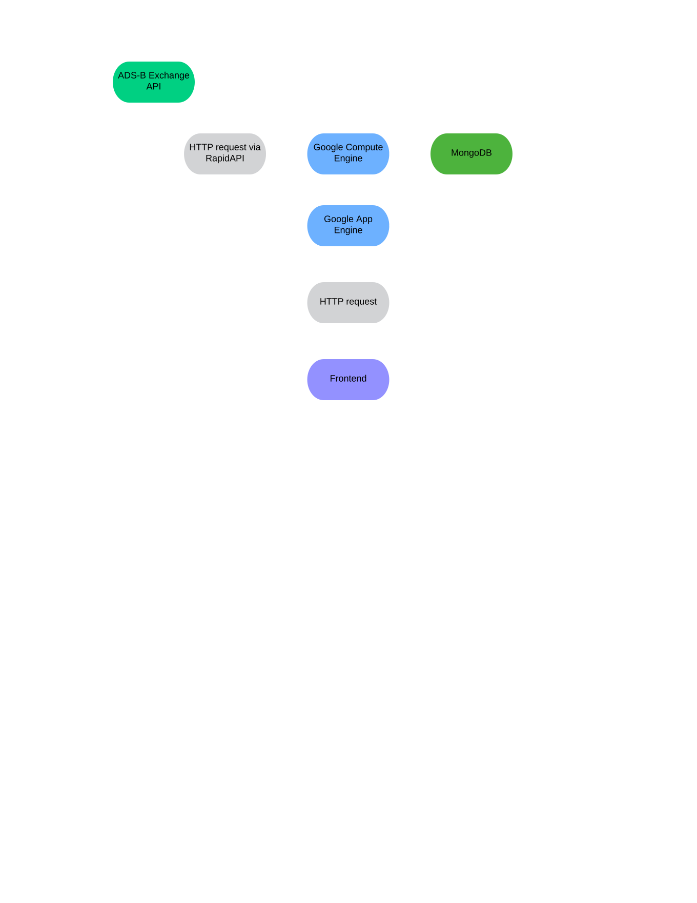

# ADS-B Military Analytics

[](https://github.com/EMcNugget/adsb_mil_data/actions/workflows/firebase-hosting-merge.yml)
[](https://github.com/EMcNugget/adsb_mil_data/actions/workflows/codeql.yml)
[](https://www.codacy.com/gh/EMcNugget/ADS-B-Military-Analytics/dashboard?utm_source=github.com&amp;utm_medium=referral&amp;utm_content=EMcNugget/ADS-B-Military-Analytics&amp;utm_campaign=Badge_Grade)

## What is this?

This allows you to view military aircraft from an ever growing database. Find out how many aircraft flew on a specific day, what type, among other features that are coming soon!


## How To Run

1. Get an API key from ADSB Exchange (<https://www.adsbexchange.com/data>)

2. Set your environment variables with said key and host with the following names: ```API_KEY``` and ```API_HOST```
   respectively. Keep in mind that for the backend a MongoDB instance is needed, you can follow the naming conventions for it in server/vm.py. You maybe will also have to change the url in client/src/components/api.fetch.tsx to the url that your Flask instance is running on.

3. Run the following command in the root directory of the project:

```bash
npm install
npm start
```

## Notes

This project is currently in active development and is deployed at <https://adsbmilanalytics.com>

## Tech Stack

| Backend             | Frontend          |
|:-------------------:|:-----------------:|
| ![Python][PY]       | ![TypeScript][TS] |
| ![Flask][Flask]     | ![React][React]   |
| ![MongoDB][MDB]     | ![Vite][Vite]     |
| ![Google Cloud][GC] | ![Firebase][FB]   |
|                     | ![SCSS][SCSS]     |

## Architecture



## Current Tasks

See the project board for the current tasks.
[Roadmap and Tasks][rm]

## Questions, Comments, Concerns?

Feel free to contact me at <support@adsbmilanalytics.com> or open an issue on the GitHub repo.

[TS]: https://img.shields.io/badge/typescript-%23007ACC.svg?style=for-the-badge&logo=typescript&logoColor=white
[Flask]: https://img.shields.io/badge/flask-%23000.svg?style=for-the-badge&logo=flask&logoColor=white
[PY]: https://img.shields.io/badge/python-3670A0?style=for-the-badge&logo=python&logoColor=ffdd54
[React]: https://img.shields.io/badge/react-%2320232a.svg?style=for-the-badge&logo=react&logoColor=%2361DAFB
[MDB]: https://img.shields.io/badge/MongoDB-%234ea94b.svg?style=for-the-badge&logo=mongodb&logoColor=white
[GC]: https://img.shields.io/badge/GoogleCloud-%234285F4.svg?style=for-the-badge&logo=google-cloud&logoColor=white
[Vite]: https://img.shields.io/badge/vite-%23646CFF.svg?style=for-the-badge&logo=vite&logoColor=white
[SCSS]: https://img.shields.io/badge/SCSS-hotpink.svg?style=for-the-badge&logo=SASS&logoColor=white
[FB]: https://img.shields.io/badge/firebase-%23039BE5.svg?style=for-the-badge&logo=firebase
[rm]: https://github.com/users/EMcNugget/projects/6
